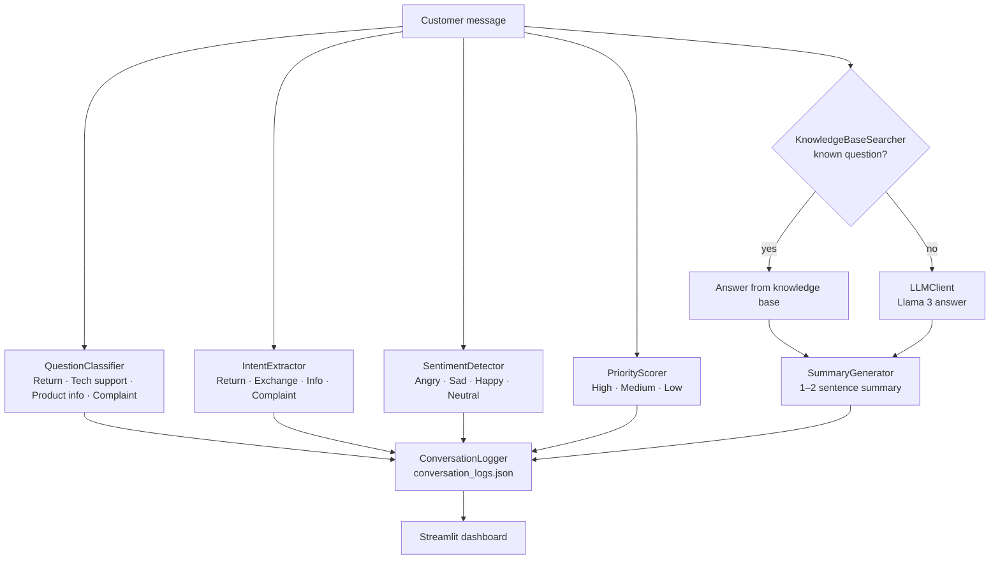

<div align="center">

# Customer Support Agent

**A local LLM pipeline that reads a customer message, understands it and answers it.**

Every message is classified, its intent and sentiment are detected, it gets a priority score, and it is answered from a knowledge base or by Llama 3. All running locally.


</div>

---

## Why

Support teams spend a large part of their day on simple, repetitive questions and on deciding which messages need attention first. This agent triages every incoming message and drafts an answer, so people can focus on the cases that really need them.

## How it works

The agent is built as a chain of small, independent nodes. Each node has one job and talks to Llama 3 through Ollama's local API.



| Node | Responsibility |
|---|---|
| `QuestionClassifier` | Assigns the message to a support category |
| `IntentExtractor` | Determines what the customer wants to do |
| `SentimentDetector` | Detects the emotional tone of the message |
| `PriorityScorer` | Scores urgency as high, medium or low |
| `KnowledgeBaseSearcher` | Returns a ready answer for frequently asked questions |
| `LLMClient` | Generates a polite Turkish answer when the knowledge base has none |
| `SummaryGenerator` | Summarizes the answer in one or two sentences |
| `ConversationLogger` | Appends every result to `conversation_logs.json` |

## Screenshots

| | |
|---|---|
|  |  |
|  |  |
|  |  |

## Getting started

**Requirements:** Python 3.10+ and [Ollama](https://ollama.com).

```bash
# 1. Pull the model (Ollama serves it on localhost:11434)
ollama pull llama3

# 2. Clone and install
git clone https://github.com/omeraydin00/customer-support-agent.git
cd customer-support-agent/YapayZeka
pip install streamlit requests

# 3. Run
streamlit run streamlit_app.py
```

The dashboard opens in your browser. Type a customer message and press **CEVAPLA**.

## Project structure

```
YapayZeka/
├── streamlit_app.py          # Dashboard and pipeline wiring
├── llm_connection/
│   └── llm_client.py         # Ollama client for answer generation
├── agent/nodes/
│   ├── classify_question.py
│   ├── extract_intent.py
│   ├── detect_sentiment.py
│   ├── priority_scoring.py
│   ├── knowledge_base_search.py
│   ├── summary_generator.py
│   └── logger.py
└── conversation_logs.json    # Saved conversations
```

---

<div align="center">
Built by <a href="https://github.com/omeraydin00">Ömer Faruk Aydın</a>
</div>
